# Planification Luminatura
---

***Luminatura***, une forêt enchantée où la lumière et la nature s’entrelacent, illuminant l’esprit à travers la magie envoûtante des lanternes et la sérénité des lotus.

## Concept
---

***Luminatura*** est une installation immersive alliant art et technologie, où des lanternes et les lotus lumineux illuminent votre parcours et des vignes décorent l'espace, créant ainsi une atmosphère accueillante. En touchant une plaque métallique, le capteur capacitif détecte la conductivité des mains de l'utilisateur et déclenche une réponse lumineuse et sonore, illustrant le potentiel de transformation que chacun peut exercer sur son environnement.

### Mise en contexte

À l'entrée de l'installation, le visiteur est accueilli par la douce lumière des lanternes et des lotus suspendus, ainsi que par les vignes décoratives qui créent une ambiance de tranquillité.

En touchant la plaque, le visiteur déclenche une lumière douce et chaleureuse, accompagnée de sons apaisants inspirés de la nature. Ce moment intime lui permet de réfléchir à ses propres expériences de transformation et d’éveiller des émotions profondes, soulignant le pouvoir de l'art et de la technologie pour toucher l'âme humaine.

## Objectif
---

L'œuvre vise à provoquer une expérience immersive où l'interaction avec des lanternes et des lotus déclenche une transformation lumineuse et sonore, nous invitant à réfléchir sur notre pouvoir d'influencer et d'illuminer notre environnement.

## Motivations
---

## Motivation créative  

Notre œuvre **Luminatura** s’inspire des profondeurs symboliques des lanternes, des vignes et des métaux, chacun porteur d’un sens profond et d’une histoire unique. À travers cette création, on cherche à établir un dialogue entre ces éléments, illuminant leur interconnexion et la manière dont ils reflètent l’expérience humaine.  

## Motivation personnelle  

Dans **Luminatura**, notre motivation personnelle réside dans le désir d'explorer comment la lumière intérieure peut guider chaque individu à travers ses propres ombres, créant une connexion entre le spectateur et son esprit. En intégrant des éléments inspirés de la culture japonaise, on cherche à répondre à un besoin de sérénité et de contemplation dans notre monde contemporain, tout en suscitant une réflexion sur notre relation avec la nature et la technologie.  

## Scénario interactif

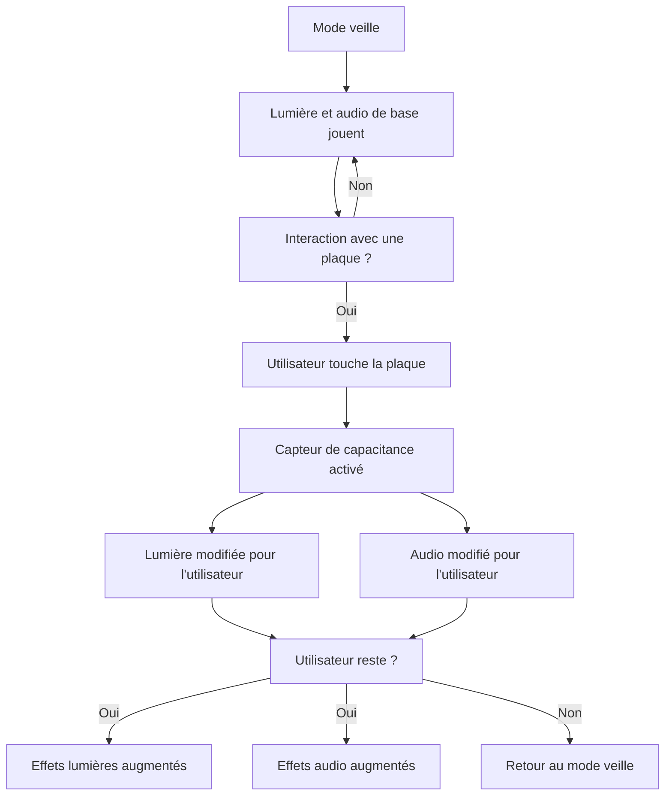

## Planche d'ambiances visuelles
---

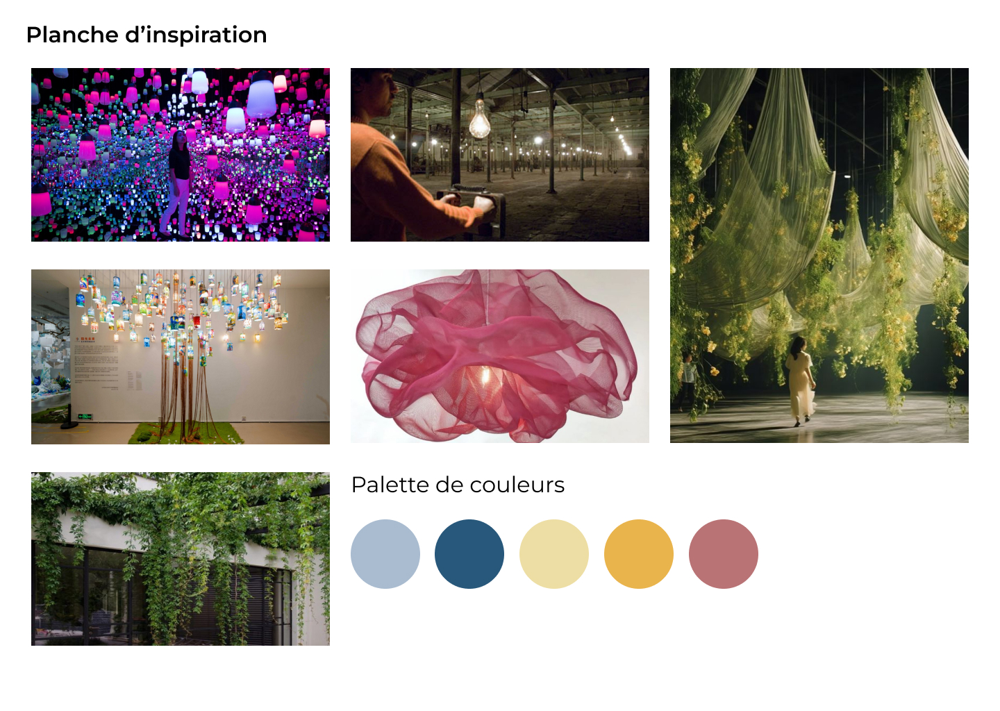

---

## Planche d'ambiances sonores
---

<iframe width="560" height="315" src="https://www.youtube.com/embed/NMbSnI1UWFM" title="YouTube video player" frameborder="0" allow="accelerometer; autoplay; clipboard-write; encrypted-media; gyroscope; picture-in-picture" referrerpolicy="strict-origin-when-cross-origin" allowfullscreen></iframe>

<iframe width="560" height="315" src="https://www.youtube.com/embed/-ytgGCetzXs" title="YouTube video player" frameborder="0" allow="accelerometer; autoplay; clipboard-write; encrypted-media; gyroscope; picture-in-picture" referrerpolicy="strict-origin-when-cross-origin" allowfullscreen></iframe>

<iframe width="560" height="315" src="https://www.youtube.com/embed/igS5kbMBJ1c" title="YouTube video player" frameborder="0" allow="accelerometer; autoplay; clipboard-write; encrypted-media; gyroscope; picture-in-picture" referrerpolicy="strict-origin-when-cross-origin" allowfullscreen></iframe>

<iframe width="560" height="315" src="https://www.youtube.com/embed/W6xjxjpHJQ0" title="YouTube video player" frameborder="0" allow="accelerometer; autoplay; clipboard-write; encrypted-media; gyroscope; picture-in-picture" referrerpolicy="strict-origin-when-cross-origin" allowfullscreen></iframe>

<iframe width="560" height="315" src="https://www.youtube.com/embed/nE_XAauwu1I" title="YouTube video player" frameborder="0" allow="accelerometer; autoplay; clipboard-write; encrypted-media; gyroscope; picture-in-picture" referrerpolicy="strict-origin-when-cross-origin" allowfullscreen></iframe>

<iframe width="560" height="315" src="https://www.youtube.com/embed/wxflcCxqebU" title="YouTube video player" frameborder="0" allow="accelerometer; autoplay; clipboard-write; encrypted-media; gyroscope; picture-in-picture" referrerpolicy="strict-origin-when-cross-origin" allowfullscreen></iframe>

## Références artistiques
---

### L'esthétique et le design

| Couleur                                 | Signification                     |
| --------------------------------------- | --------------------------------- |
| Bleu pâle  | Paix et introspection             |
| Bleu foncé | Vérité et tranquillité            |
| Jaune      | Chaleur, lumière et joie de vivre |
| Orange     | Activité et émotion               |
| Rouge      | Énergie et intensité              |

L'esthétique de ***Luminatura*** repose sur une harmonie entre lumière et ombre, évoquant une atmosphère de sérénité et de contemplation. 

Le design intègre également des éléments contemporains, tels que des structures métalliques et des dispositifs technologiques, pour offrir une expérience immersive qui invite les spectateurs à interagir avec leur environnement lumineux et sonore.

### Choix de références visuelles

***Luminatura*** s'inspire des lanternes captivantes de ***Forest of Resonating Lamps - One Stroke***, où chaque lumière interagit avec son environnement, créant une atmosphère magique. De plus, l'œuvre ***Pulse Room*** de Rafael Lozano-Hemmer enrichit notre concept en intégrant une dimension sonore réactive, renforçant ainsi l'expérience immersive de Luminatura.

### Choix de références sonores

Pour ***Luminatura***, les choix d'ambiances sonores se concentrent sur l'harmonie entre lumière et son, créant ainsi une expérience immersive et poétique. Les sons naturels, tels que les bruits de la forêt et les murmures d'eau, renforcent la connexion avec la nature, tandis que les mélodies douces et les vibrations réactives des lanternes évoquent une atmosphère envoûtante et interactive.

## Synoptique
---
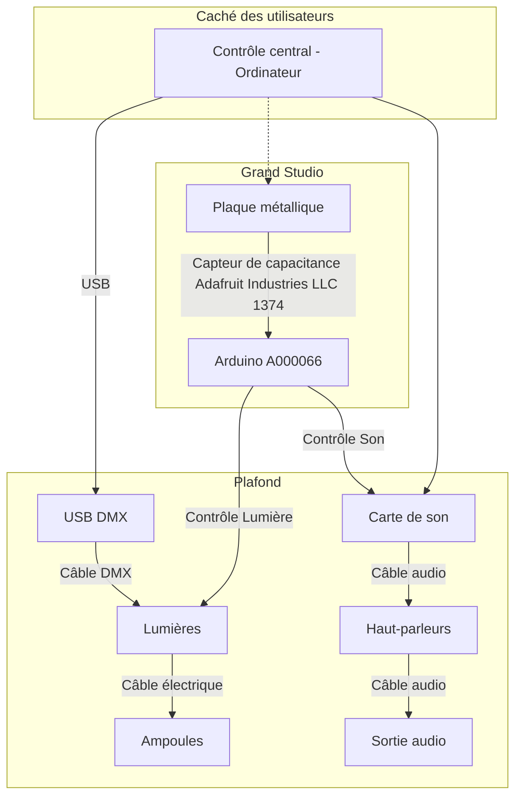

## Scénarimage
---
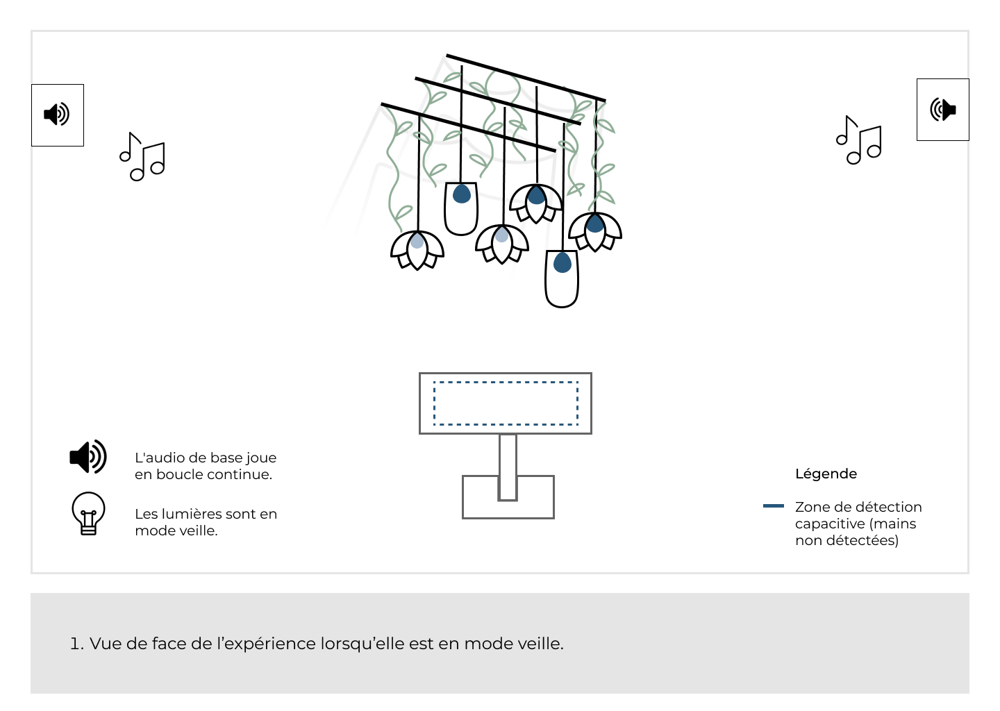
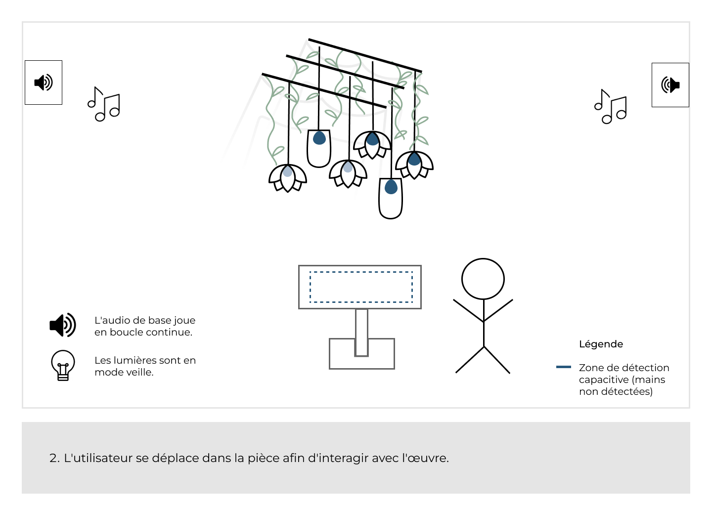
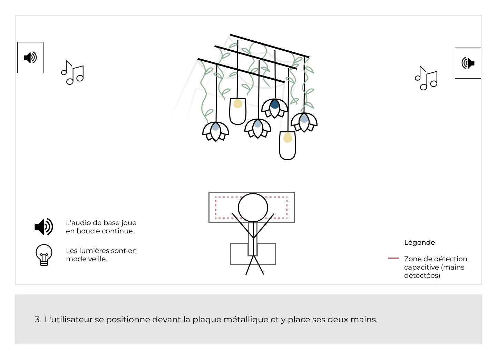
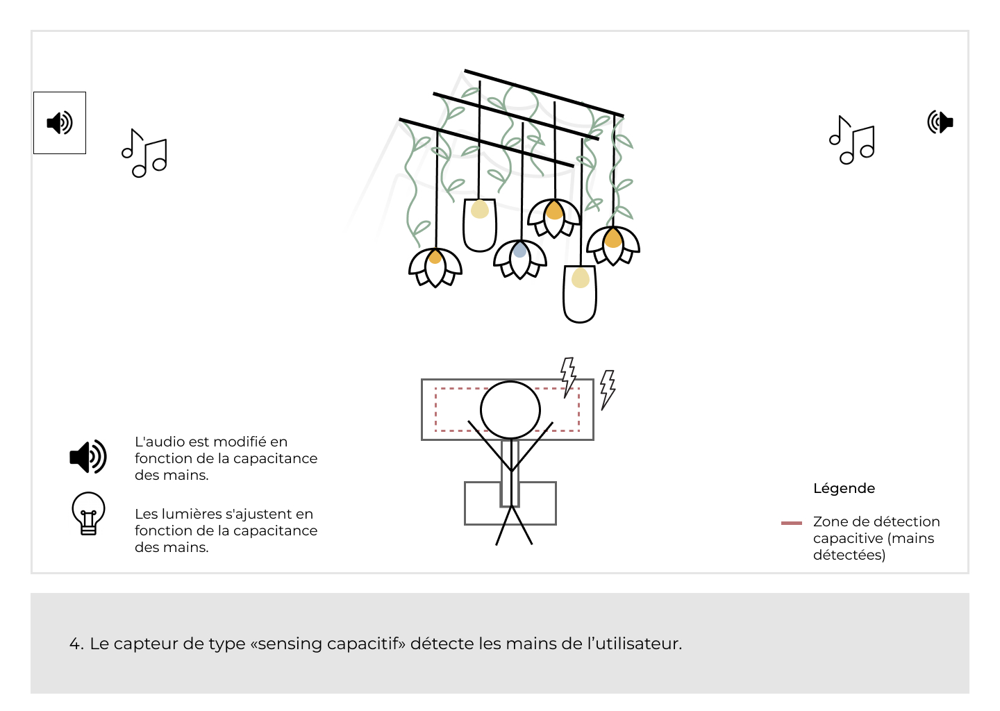
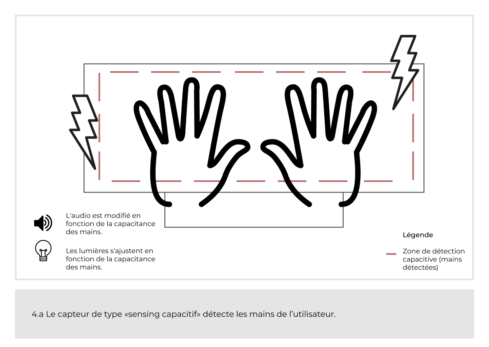
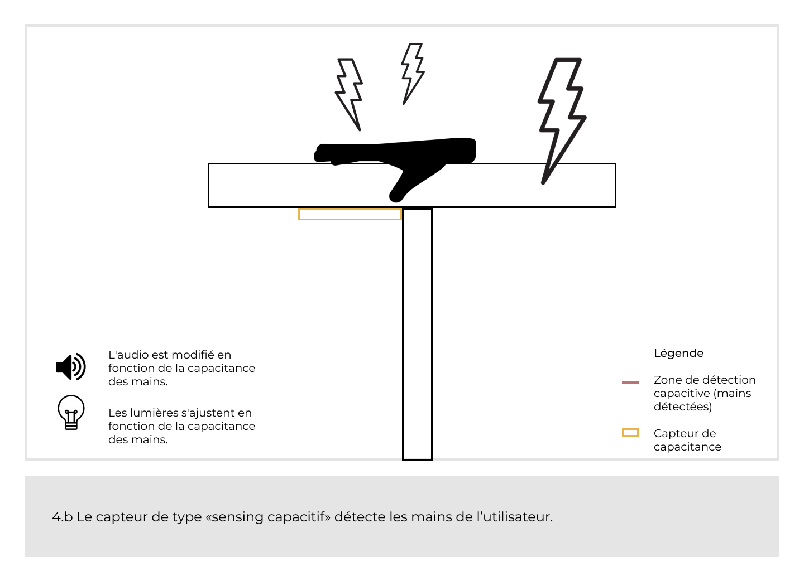
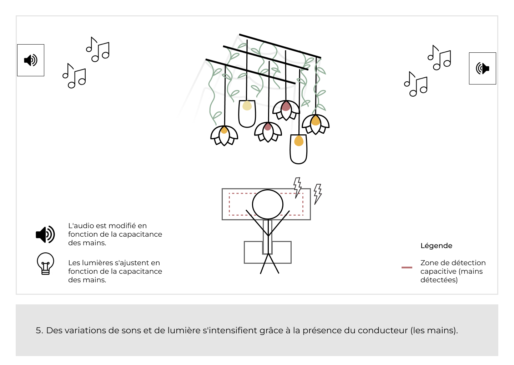
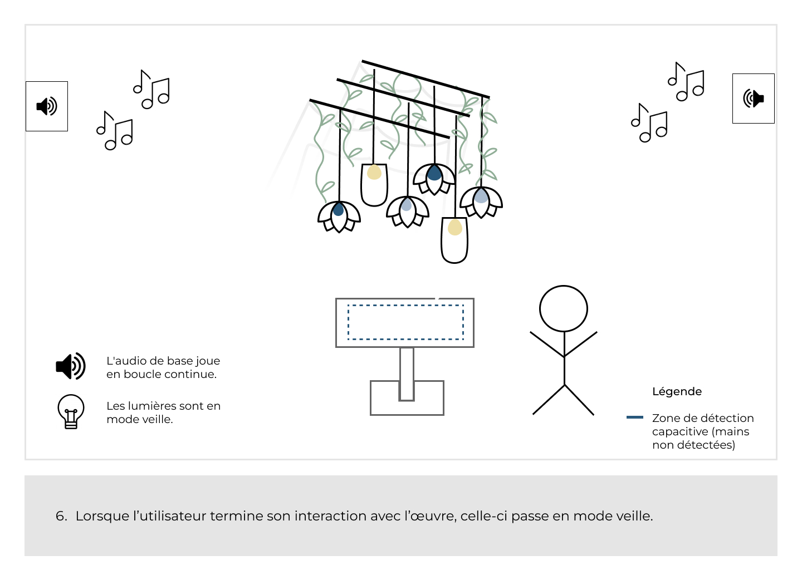

## Plantation
---
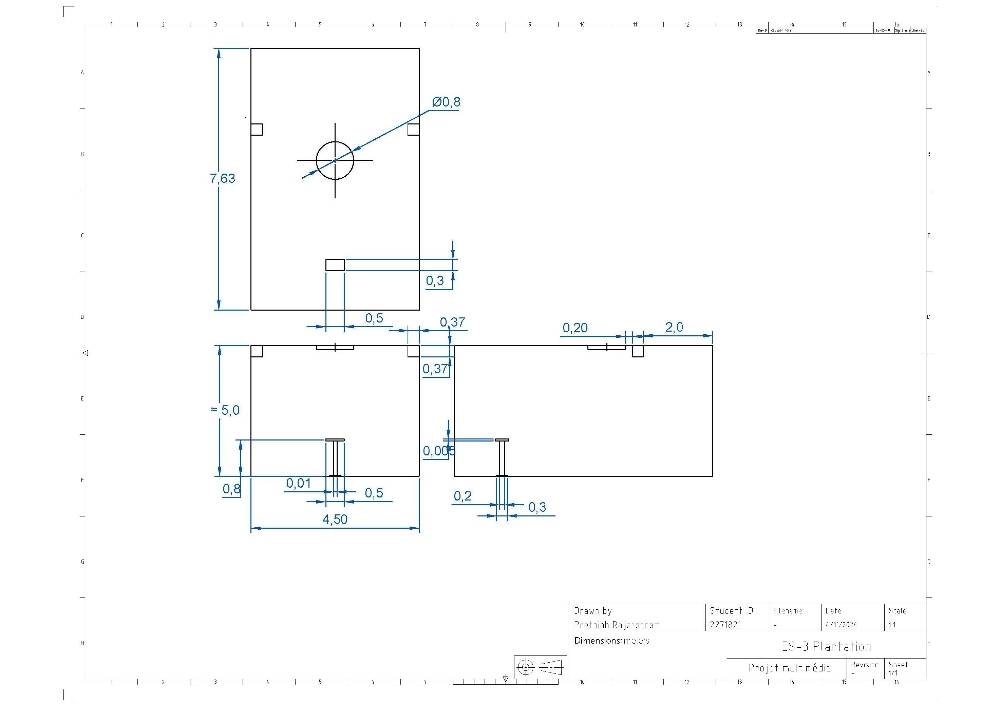
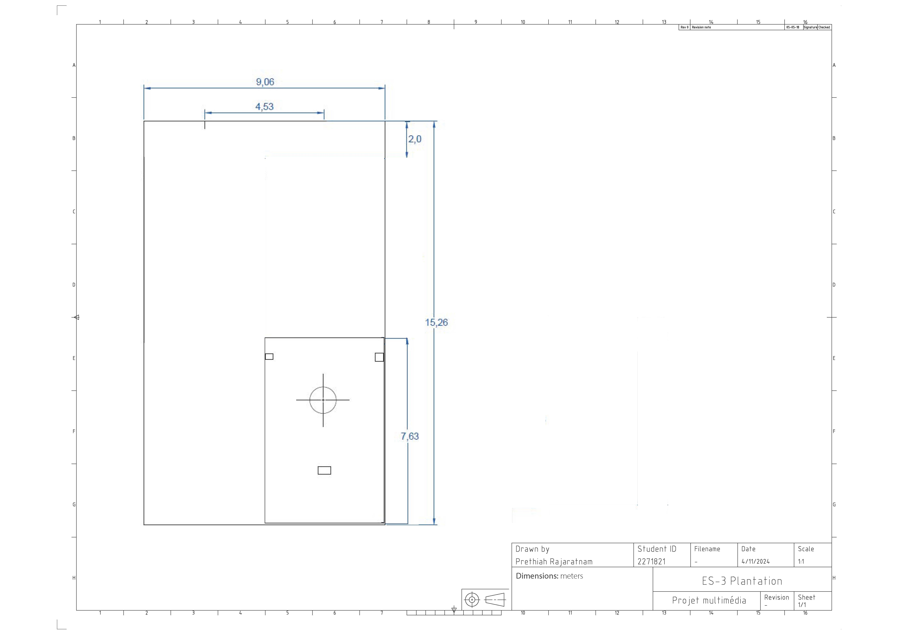

## Simulation

## Distribution des responsabilités
| Tâches                   | Membre(s) de l'équipe |
| ------------------------ | ------------------ |
| Création sonore          | Audrey D.          |
| Assemblage des lotus      | Camilia B. et Justine R. |
| Programmation de la capacitance | Ihab M., Prethiah R. et Justine R |
| Assemblage des lanternes | Camilia B. et Audrey D. |
| Intégration des lumières | Ihab M., Prethiah R. et Justine R. |
| Décorations | Camilia B. et Audrey D. |
| Construction de la plaque métallique | Ihab M. et Prethiah R. |

##  Échéancier

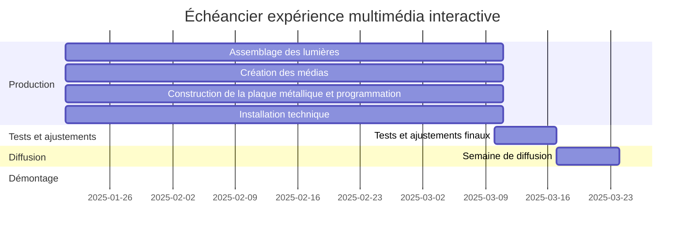

## Devis Technique
---
### Équipements et matériaux
---
### Équipements fournis par les artistes

- 15-20 vignes artificielles en plastique 
- 8 ampoules LED 
- Mousse verte artificielle
- 4 rideaux/voilages blancs 
- plante artificielle/feuilles (quantité à déterminer, selon l’usage prévu)
- 1 plaque en acier inoxydable 
- 4 lanternes 
- 4 lotus
- Régulateur de tension
- Éléments de fixation
- Plaque ronde en bois (épaisseur 1,5mm)
- 1 Plaque isolante
  
#### Capteurs et évaluation

| Capteur de type « sensing capacitif »                    | Composants                   |
| -------------------------------------------------------- | ---------------------------- |
| Carte d'évaluation pour microcontrôleurs embarqués (MCU) | Arduino A000066              |
| Résistances traversantes                                 | YAGEO CFR-25JB-52-3M6        |
| Carte d'évaluation de capteurs                           | Adafruit Industries LLC 1374 |

#### Support en métal

| Support en métal pour la plaque métallique | Composants                        |
| ------------------------------------------ | --------------------------------- |
| 1 tube en acier                            | Structure principale du « stand » |
| 1 base plate                               | Assurer la stabilité du « stand » |
| Vis et boulons                             | Assemblage et durabilité          |

### Équipements fournis par le cégep

- Câbles (HDMI, Ethernet, audio)
- Fils de prototypage
- 1 ordinateur (gestion des interactions en temps réel)
- 2 haut-parleurs GENELEC 8040B

### Logiciels 

---
### Logiciels fournis par les artistes
  
| Logiciel | Technique                                                         |
| -------- | ----------------------------------------------------------------- |
| Reaper   | Montage sonore (de base)                                          |
| Arduino  | Capteur de type « sensing capacitif » et connexion des composants |

### Logiciels fournis par le cégep

| Logiciel       | Technique                                                     |
| -------------- | ------------------------------------------------------------- |
| Max Cycling 74 | Modification des paramètres audio en réponse à des événements |
| QLC+           | Création des scènes lumineuses                                |
| Plugdata       | Modification de la couleur des lumières                       |

### Mise en réseau et communication

---
### Fourni par le cégep

| Système de communication | Logiciel | Interaction         |
| ------------------------ | -------- | ------------------- |
| Protocole MIDI           | LoopMidi | QLC+ et Plugdata    |
| Protocole DMX            | QLC+     | Lumière et logiciel |

### Étude de faisabilité
---

#### Faisabilité technique

##### Logiciels

| Logiciels                                                                 | Matériaux                    | Interfaces utilisateurs                                     | Protocoles de communication                                             |
| ------------------------------------------------------------------------ | ---------------------------- | ----------------------------------------------------------- | ----------------------------------------------------------------------- |
| [Reaper Version 6.13](https://www.reaper.fm/download-old.php?ver=6x)     | Arduino A000066              | Plaque métallique sensible au toucher                       | [Protocole  DMX](https://www.qlcplus.org/)                              |
| [Arduino IDE 2.3.2](https://www.arduino.cc/en/software)                  | YAGEO CFR-25JB-52-3M6        | Éléments lumineux (Lotus et Lanternes)                      | [Protocole MIDI](https://www.tobias-erichsen.de/software/loopmidi.html) |
| [Max Cycling 74 Version 8.6.2](https://cycling74.com/releases/max/8.6.2) | Adafruit Industries LLC 1374 | [Systèmes sonores immersifs](https://www.genelec.com/8040b) |
| [QLC+ 4.13.1](https://www.qlcplus.org/forum/viewtopic.php?t=17417)       | 1 plaque en acier inoxydable    | Technologie capacitive (Adafruits et Arduino UNO R3)        |
| [Plugdata v0.9.1](https://plugdata.org/download.html)                    |                              | Régulateur de tension                                       |

#### Faisabilité économique

| Logiciels                                                                  | Prix                           |
| -------------------------------------------------------------------------- | ------------------------------ |
| [Reaper Version 6.13](https://www.reaper.fm/download-old.php?ver=6x)       | Gratuit                        |
| [Arduino IDE 2.3.2](https://www.arduino.cc/en/software)                    | Gratuit                        |
| * [Max Cycling 74 Version 8.6.2](https://cycling74.com/releases/max/8.6.2) | (18,99$ par mois) x 2 = 37.98$ |
| [QLC+ 4.13.1](https://www.qlcplus.org/forum/viewtopic.php?t=17417)         | Gratuit                        |
| [Plugdata v0.9.1](https://plugdata.org/download.html)                      | Gratuit                        |
| **Total**                                                                  | **37.98$**                     |

*Payant si les artistes utilisent leur propre ordinateur personnel, ou possibilité d'utiliser gratuitement les ordinateurs fournis par TIM.

| Matériaux                                                                                                                                                                                                                                             | Prix                                  |
| ----------------------------------------------------------------------------------------------------------------------------------------------------------------------------------------------------------------------------------------------------- | ------------------------------------- |
| [Tôle d'acier](https://www.homedepot.ca/produit/paulin-tle-dacier-de-24-x-24-po-de-calibre-22/1000861565?eid=PS_GOOGLE_D00_Corporate_GGL_Shopping_All-Products_All%20Products__PRODUCT_GROUP_pla-298495632901&pid=1000861565&store=7124&gad_source=4) | 24,97 $ + 15%TPS et TVQ  = 28.72$     |
| [ARDUINO UNO R3 ATMEGA328P BOARD](https://www.digikey.ca/en/products/detail/arduino/A000066/2784006)                                                                                                                                                  | 34.87$                                |
| [Plaque insolante](https://www.homedepot.ca/produit/handi-pac-panneau-isolant-rigide-en-mousse-de-polystyrne-expans-075-po-x-145-po-x-48-po-rsistance-thermique-de-281/1000137182?eid=PS_GO_140203__ALL_PLA-526641&pid=1000137182&store=7159)         | 17.29$ + 15%TPS et TVQ = 19.88$       |  | [Plante artificielle](https://www.ikea.com/ca/fr/p/fejka-plante-artificielle-fixation-murale-interieur-exterieur-vert-90546572/) | (4.99$ x 3) + 15%TPS et TVQ = 17.25$ |
| [Fleur artificielle](https://www.ikea.com/ca/fr/p/smycka-fleur-artificielle-interieur-exterieur-plante-tropicale-bouquet-80562732/)                                                                                                                   | (3.99$ x 2) = 9.20$                   |
| [Mousse verte artificielle](https://canada.michaels.com/product/moss-table-runner-by-ashland-10135021?com_id=pdp_AlsoLike&path=youMayAlsoLike)                                                                                                        | (21.99$ x 2) = 50.6$                  |
| [YAGEO CFR-25JB-52-3M6](https://www.digikey.ca/en/products/detail/adafruit-industries-llc/1374/6238002)                                                                                                                                               | 0.16$                                 |
| [Adafruit Industries LLC 1374](https://www.digikey.ca/en/products/detail/yageo/CFR-25JB-52-3M6/1467)                                                                                                                                                  | 9.43$                                 |
| [4 lanternes](https://www.ikea.com/ca/en/p/borrby-lantern-for-block-candle-indoor-outdoor-black-10156109/)                                                                                                                                            | (9.99$ x 4) + 15%TPS et TVQ = 45.95$  |
| [Plaque ronde en bois 1/2 x 32" x 32"](https://patrickmorin.com/fr/coupe-de-materiaux)                                                                                                                                                                | 44$ + 15%TPS et TVQ = 50.6$           |
| [4 rideaux/voilages blanc ](https://www.ikea.com/ca/fr/p/teresia-voilage-2-panneaux-blanc-90232331/)                                                                                                                                                  | (14,99$ x 4) + 15%TPS et TVQ = 68.95$ |
| [Vignes articielles](https://www.amazon.ca/-/fr/artificielles-d%C3%A9coration-feuilles-suspendues-guirlande/dp/B08BZ6CNVP?source=ps-sl-shoppingads-lpcontext&ref_=fplfs&psc=1&smid=A3MSBQ5ESVX8AF)                                                    | 11,99$ + 15%TPS et TVQ = 13.78$       |
| [Régulateur de tension](https://addison-electronique.com/fr/regulateur-de-tension-positif-l7812cv-12-v-1-5-a-to-220.html)                                                                                                                             | 1,99 $ + 15%TPS et TVQ = 2.29$        |

- 8 ampoules LED 
- 1 plaque acier inoxydable  
- 4 lotus

##### Développement et maintenance

Une quantité supplémentaire de plusieurs matériaux pourrait être nécessaire en cours de route du projet:

- [Adafruit Industries LLC 1374](https://www.digikey.ca/en/products/detail/yageo/CFR-25JB-52-3M6/1467) 
- [Fleur artificielle](https://www.ikea.com/ca/fr/p/smycka-fleur-artificielle-interieur-exterieur-plante-tropicale-bouquet-80562732/) 
- [Mousse verte artificielle](https://canada.michaels.com/product/moss-table-runner-by-ashland-10135021?com_id=pdp_AlsoLike&path=youMayAlsoLike)   
- Ampoules LED 
- [Plaque ronde en bois 1/2 x 32" x 32"](https://patrickmorin.com/fr/coupe-de-materiaux)
- Tissus lotus
- [4 rideaux/voilages blanc ](https://www.ikea.com/ca/fr/p/teresia-voilage-2-panneaux-blanc-90232331/)    
- [Vignes articielles](https://www.amazon.ca/-/fr/artificielles-d%C3%A9coration-feuilles-suspendues-guirlande/dp/B08BZ6CNVP?source=ps-sl-shoppingads-lpcontext&ref_=fplfs&psc=1&smid=A3MSBQ5ESVX8AF)                                                    
- Éléments de fixation

#### Options de financement

##### Sources potentielles de financement

- **Bourse Perspective Québec**
- **Montant accordé par le Cégep** : Fonds dédiés spécifiquement pour couvrir les coûts du projet, incluant les matériaux, équipements et autres besoins essentiels.

#### Faisabilité opérationnelle

##### Ressources humaines

- **Maîtrise du logiciel Max (Cycling '74)** : Essentiel pour gérer les interactions sonores dans l'installation.
- **Connaissance des protocoles DMX et MIDI** : Nécessaire pour synchroniser les lumières et les éléments sonores.
- **Expertise avec QLC+** : Indispensable pour contrôler les effets lumineux et leur coordination avec les capteurs.
- **Compétence en programmation (C/C++)** : Utile pour développer et optimiser les fonctionnalités des capteurs et du système Arduino.
- **Connaissances en construction** : Primordial pour l'assemblage sécurisé et la maintenance de la structure physique.

##### Gestion du changement

- **Intégration des nouvelles technologies** : Planifier comment l'introduction des capteurs capacitifs et des nouveaux logiciels (Max, QLC+) affectera les opérations quotidiennes.
- **Accompagnement des membres de l’équipe** : Offrir un soutien pour l’adoption des outils et procédures.

##### Support et maintenance

- **Prévoir les besoins à long terme** : Établir un plan pour le support technique et la maintenance régulière des composants interactifs (capteurs, LEDs, systèmes audio).
- **Calendrier de maintenance préventive** : Créer un programme d'entretien pour vérifier régulièrement l'état des capteurs et systèmes lumineux.
- **Documentation technique** : Maintenir une documentation claire et accessible pour faciliter les réparations et mises à jour futures.

#### Faisabilité temporelle

##### Planification du projet

##### Calendrier des cas de test

###### Cas de test 1.1 : Lumière d’accueil des lanternes et lotus lumineux (Éclairage d’ambiance initial)
**Semaine 1 – 2**

###### Cas de test 1.2 : Sons d’accueil des lanternes et lotus lumineux (Musique d’ambiance initiale)
**Semaine 1 – 2**

###### Cas de test 2.1 : Réponse lumineuse au toucher de la plaque
**Semaine 3 – 4**

###### Cas de test 2.2 : Réponse sonore au toucher de la plaque métallique
**Semaine 3 – 4**

###### Cas de test 3.1 : Réponse continue des lumières pendant un contact prolongé avec la plaque
**Semaine 4 – 5**

###### Cas de test 3.2 : Réponse continue des effets sonores pendant un contact prolongé avec la plaque
**Semaine 4 – 5**

###### Cas de test 4.1 : Lumière après relâchement de la plaque
**Semaine 5**

###### Cas de test 4.2 : Réponse sonore après le relâchement de la plaque
**Semaine 5**

###### Cas de test 5.1 : Réponse lumineuse aux contacts multiples
**Semaine 6**

###### Cas de test 5.2 : Réponse sonore aux contacts multiples
**Semaine 6**

##### Gestion des risques 

##### Risques techniques

- **Structure non sécurisée** : 
  - La structure pourrait manquer de solidité, entraînant une fragilité durant l’expérience et compromettant la stabilité de l’installation.  
  - **Plan d'urgence** : Réaliser des tests de charge détaillés et renforcer les points d’attache au plafond.

- **Détection incorrecte par la plaque métallique** : 
  - La plaque métallique utilisée pour détecter les interactions pourrait ne pas capter correctement les changements de conductivité des mains, entraînant un dysfonctionnement de l'interactivité lumineuse et sonore.  
  - **Plan d'urgence** : Tester et calibrer la plaque avant l’installation finale avec différents scénarios d’interaction utilisateur.

- **Chaleur excessive des LEDs** : 
  - Les ampoules LED pourraient émettre une chaleur excessive, endommageant les fleurs artificielles et affectant l'esthétique ainsi que la durabilité de l'installation.  
  - **Plan d'urgence** : Utiliser des LEDs basse consommation et prévoir une isolation thermique autour des fleurs artificielles.

- **Bris de la structure circulaire lors de l’installation** : 
  - La structure circulaire pourrait être endommagée ou mal alignée durant son installation au plafond.  
  - **Plan d'urgence** : Prévoir des outils de levage adaptés et renforcer la structure avec des matériaux résistants.

##### Risques liés aux connaissances techniques

- **Communication Arduino et QLC+** : 
  - Un manque de connaissances sur l’intégration d’Arduino avec QLC+, essentiel pour la gestion des effets lumineux, pourrait ralentir le projet.  
  - **Plan d'urgence** : Former l’équipe sur la configuration Arduino-QLC+ à l’aide de tutoriels et de guides spécialisés.

- **Précision du capteur capacitif** : 
  - Une compréhension limitée du fonctionnement du capteur capacitif pourrait réduire la précision de détection et limiter son intégration au système.  
  - **Plan d'urgence** : Mener des tests approfondis sur le capteur et consulter des experts en électronique pour des ajustements.

- **Communication Arduino et Max 8** : 
  - Un manque de connaissances approfondies sur l’interconnexion entre Arduino et Max 8 pourrait entraîner des problèmes d’intégration et de synchronisation des éléments interactifs et sonores.  
  - **Plan d'urgence** : Programmer des sessions d’apprentissage spécifiques sur Max 8 et réaliser un prototype de test avant l’installation.

##### Risques opérationnels

- **Retards dans le projet** : 
  - Identifications tardives des risques ou manques de coordination pourraient retarder l’avancement global du projet.  
  - **Plan d'urgence** : Mettre en place un calendrier détaillé avec des points de contrôle hebdomadaires pour suivre l’avancement et anticiper les retards.

#### Faisabilité légale et éthique

##### Conformité réglementaire
- **Sécurisation des objets suspendus au plafond** : Tous les objets suspendus doivent être sécurisée afin d'éviter les accidents. Il est aussi important d'utiliser des matériaux légers que les tubes du haut peuvent bien supporter, comme l'aluminium (pour la plaque du haut), le papier (pour les lotus) et le polycarbonate (pour les lanternes). Au besoin, faire une vérification régulière des installations.
- **Feu** : Pour prévenir tout risque d’incendie, il est important d’utiliser des ampoules à LED, qui produisent moins de chaleur que les ampoules traditionnelles. Il faut vérifier régulièrement l’état des ampoules et des câblages électriques afin de s’assurer qu’il n’y a pas de risques d'échauffement excessif.
- **Électrocution** : Pour se protéger contre les risques d’électrocution, il est primordial d'utiliser des câbles et des prises adaptées à l'environnement d'installation. S’assurer que toutes les connexions électriques sont correctement isolées et que les interrupteurs sont accessibles mais protégés contre tout contact accidentel

##### Accessibilité
- **Handicap physique** : La plaque métallique devrait être installée à une hauteur qui permet à une personne en fauteuil roulant de l'atteindre facilement, généralement à une hauteur entre 85 et 100 cm du sol. L’espace autour de la plaque ou dispositif doit être dégagé, permettant ainsi une circulation aisée en fauteuil roulant. 
- **Épilepsie** : Pour éviter de provoquer des crises d'épilepsie chez les personnes sensibles, les ampoules doivent changer de lumières avec des transitions douces.

### Considérations spécifiques aux technologies interactives
---

#### Expérience utilisateur (UX)

- **Interaction tactile directe** : Les utilisateurs déclenchent des changements sonores et lumineux par un toucher précis sur la plaque métallique. Ce mécanisme crée une connexion immédiate entre l'utilisateur et l'installation.
- **Retour en temps réel** : Les effets sonores et lumineux se produisent simultanément et sans latence, offrant une expérience fluide et réactive.
- **Conception intuitive** : L'interface (plaque métallique) est simple à comprendre, permettant à l'utilisateur·rice de se concentrer entièrement sur l'expérience interactive, sans distraction technique.
- **Accessibilité et immersion** : L'interactivité sensorielle plonge les utilisateurs dans une expérience immersive, ludique et engageante, favorisant la découverte active.

#### Évolutivité

- **Ajout de haut-parleurs supplémentaires** : De nouveaux haut-parleurs peuvent être intégrés pour étendre la couverture sonore et améliorer l'immersion sans perturber l'installation audio existante.
- **Ajout d'une projection** : Un projecteur peut être installé pour diffuser des animations interactives qui réagissent aux actions des utilisateurs sur la plaque métallique. Cette projection enrichit l'expérience visuelle et élargit l'espace interactif.
- **Mise à jour des effets lumineux** : De nouveaux modes d’éclairage peuvent être programmés pour s'adapter à l'heure de la journée ou aux saisons, enrichissant ainsi l’expérience visuelle tout en maintenant l’aspect sonore initial.

#### Sécurité

- **Mises à jour régulières** : Les logiciels et dispositifs connectés sont mis à jour régulièrement afin de corriger les éventuelles vulnérabilités de sécurité.
- **Audits de sécurité** : Des audits réguliers sont réalisés pour identifier et résoudre toute faille, garantissant une protection continue contre les cybermenaces.

### Documentation des technologies explorées
---

#### Agrégation de la documentation

- [Adafruit Industries LLC 1374](https://www.yageo.com/upload/media/product/app/datasheet/lr/yageo-cfr_datasheet.pdf)
- [ARDUINO UNO R3 ATMEGA328P BOARD](https://mm.digikey.com/Volume0/opasdata/d220001/medias/docus/2262/A000066_Web.pdf)
- [BOARD YAGEO CFR-25JB-52-3M6](https://mm.digikey.com/Volume0/opasdata/d220001/medias/docus/5011/1374_Web.pdf)

#### Exemples de code et d'utilisation

- [How to Add Capacitive Sensing to Any Arduino Project](https://www.digikey.ca/en/maker/tutorials/2021/how-to-add-capacitive-sensing-to-any-arduino-project?msockid=1d6850aaf64a65b4178e445ff73e64f3)
- [CapacitiveSensor Library](https://www.pjrc.com/teensy/td_libs_CapacitiveSensor.html)
- [Make A Basic Capacitive Sensor For An Arduino Board With Electric Paint](https://www.bareconductive.com/blogs/resources/make-a-basic-capacitive-sensor-with-electric-paint-and-arduino)

#### Partage des connaissances

##### Outils collaboratifs pour l'historique du projet
- [Trello Luminatura](https://trello.com/b/GV0G0usw/luminatura) : Suivi des tâches, idées et évolutions du projet, permettant une collaboration fluide entre les membres de l'équipe.

##### Réunions régulières
- **Fréquence :** Tous les vendredis à 17 h.
- **Objectif :** Faire le point sur l’avancement des tâches, partager les découvertes techniques et ajuster les priorités pour la semaine suivante.

##### Formation continue
- **Exploration technique :** Étude approfondie des documentations liées à la capacitance et des matériaux utilisés pour optimiser l’interactivité.
- **Temps dédié :** Durant les périodes libres, chaque membre est encouragé à approfondir ses connaissances et à expérimenter des idées innovantes pour enrichir le projet.

### Cas pratiques de Luminatura  
---

**Luminatura** est une installation interactive mise en place dans le grand studio du Collège Montmorency. Elle permet aux étudiants et visiteurs d’interagir avec un système lumineux et sonore grâce à un capteur capacitif. En touchant une surface spécifique, comme une plaque métallique connectée au capteur, des effets visuels et sonores se déclenchent en temps réel, créant une expérience immersive et engageante.  

#### Techniquement  

- **Intégration du capteur capacitif :** Tester la compatibilité du capteur capacitif avec les systèmes lumineux et sonores existants pour assurer une détection précise et fiable des interactions.  
- **Calibration du capteur :** Régler la sensibilité du capteur capacitif afin de garantir une activation cohérente tout en évitant les fausses détections.  
- **Synchronisation des effets :** Configurer le système pour que les effets lumineux et sonores se déclenchent simultanément lors de l’activation du capteur capacitif.  
- **Stabilité et durabilité :** Effectuer des tests pour s’assurer que le capteur peut fonctionner efficacement sous une utilisation répétée et prolongée.  
- **Sécurité électrique :** Vérifier que l’installation respecte les normes de sécurité électrique pour garantir une expérience sans risque pour les utilisateurs.  

#### Économiquement  

- **Coût du capteur capacitif :** Évaluer les dépenses liées à l’achat et à l’installation du capteur capacitif.  
- **Optimisation des ressources existantes :** Réutiliser les équipements disponibles, comme les LEDs et les systèmes audio, pour réduire les coûts d’installation.  
- **Efficacité énergétique :** Identifier des composants économes en énergie pour minimiser les dépenses d’exploitation.  
- **Potentiel de financement :** Explorer des opportunités de subventions ou partenariats pour soutenir le projet, comme la *Bourse Perspective Québec*.  
- **Retour sur investissement :** Estimer comment cette installation pourrait accroître l’attractivité et la visibilité du studio pour des projets futurs.  

#### Opérationnellement  

- **Maintenance préventive :** Mettre en place un calendrier régulier pour l’entretien du capteur capacitif et des équipements associés, comme les LEDs et les connexions électriques.  
- **Plan de remplacement :** Élaborer une stratégie pour remplacer rapidement les équipements défectueux afin de minimiser les interruptions.  
- **Simplicité d’utilisation :** Veiller à ce que l’installation soit intuitive pour les utilisateurs, avec un retour clair sur les interactions.  
- **Formation :** Prévoir une formation pour les opérateurs en charge de superviser et maintenir le système.  
- **Accessibilité :** S’assurer que l’installation est accessible à tous les publics, y compris les personnes à mobilité réduite.  

#### Documentation

##### Agrégation des ressources 

- [Documentation Reaper](https://www.reaper.fm/userguide.php)
- [Documentation Plugdata](https://plugdata.org/documentation.html)
- [Documentation QLC+](https://docs.qlcplus.org/v4)
- [Documentation Arduino](https://docs.arduino.cc/)
- [Documentation LoopMidi](https://www.tobias-erichsen.de/software.html)

