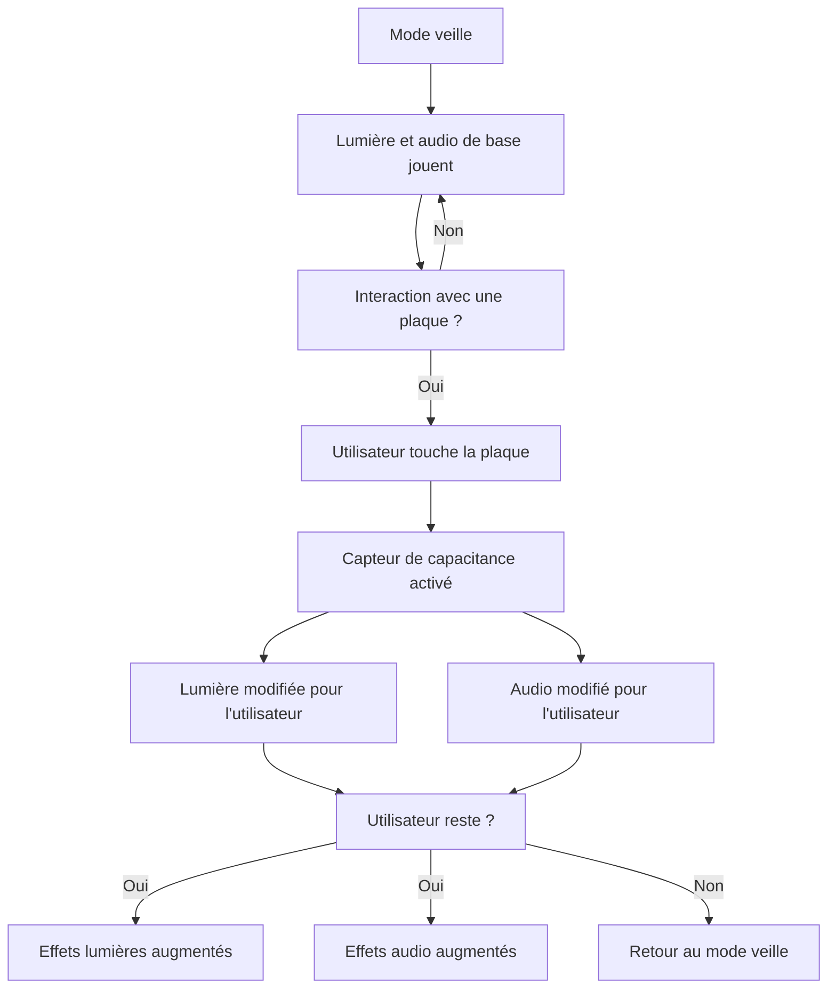
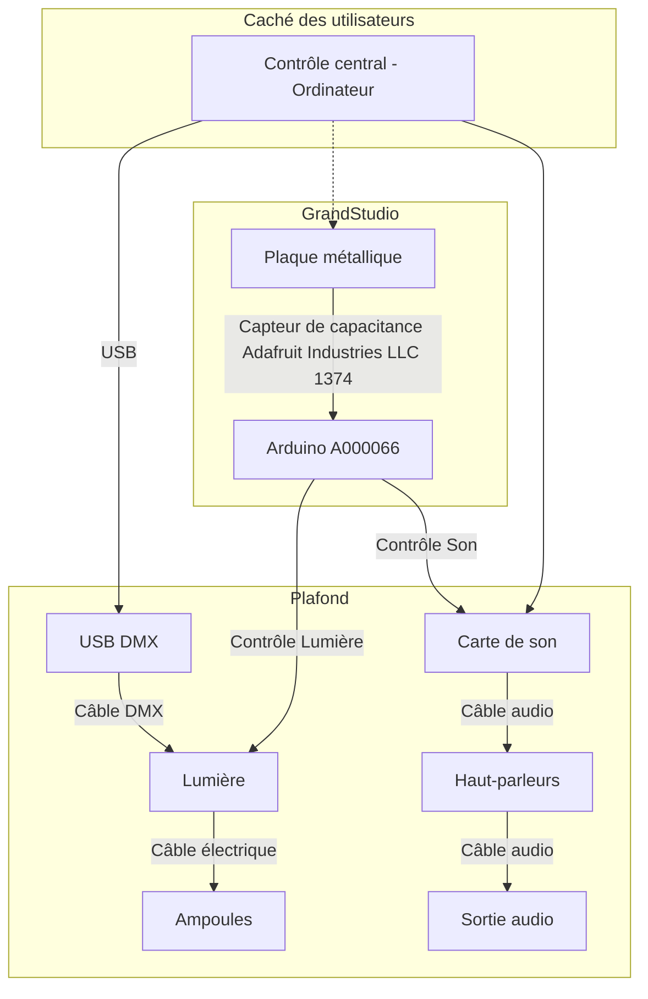

# Planification Luminatura
---

***Luminatura***, une forêt enchantée où la lumière et la nature s’entrelacent, illuminant l’esprit à travers la magie envoûtante des lanternes et la sérénité des lotus.

## Concept
---

***Luminatura*** est une installation immersive alliant art et technologie, où des lanternes et les lotus lumineux illuminent votre parcours et des vignes décorent l'espace, créant ainsi une atmosphère accueillante. En touchant une plaque métallique, le capteur capacitif détecte la conductivité des mains de l'utilisateur et déclenche une réponse lumineuse et sonore, illustrant le potentiel de transformation que chacun peut exercer sur son environnement.

### Mise en contexte

À l'entrée de l'installation, le visiteur est accueilli par la douce lumière des lanternes et des lotus suspendus, ainsi que par les vignes décoratives qui créent une ambiance de tranquillité.

En touchant la plaque, le visiteur déclenche une lumière douce et chaleureuse, accompagnée de sons apaisants inspirés de la nature. Ce moment intime lui permet de réfléchir à ses propres expériences de transformation et d’éveiller des émotions profondes, soulignant le pouvoir de l'art et de la technologie pour toucher l'âme humaine.

## Objectif
---

L'œuvre vise à provoquer une expérience immersive où l'interaction avec des lanternes et des lotus déclenche une transformation lumineuse et sonore, nous invitant à réfléchir sur notre pouvoir d'influencer et d'illuminer notre environnement.

## Motivations
---

## Motivation créative  

Notre œuvre **Luminatura** s’inspire des profondeurs symboliques des lanternes, des vignes et des métaux, chacun porteur d’un sens profond et d’une histoire unique. À travers cette création, on cherche à établir un dialogue entre ces éléments, illuminant leur interconnexion et la manière dont ils reflètent l’expérience humaine.  

## Motivation personnelle  

Dans **Luminatura**, notre motivation personnelle réside dans le désir d'explorer comment la lumière intérieure peut guider chaque individu à travers ses propres ombres, créant une connexion entre le spectateur et son esprit. En intégrant des éléments inspirés de la culture japonaise, on cherche à répondre à un besoin de sérénité et de contemplation dans notre monde contemporain, tout en suscitant une réflexion sur notre relation avec la nature et la technologie.  

## Scénario interactif

## Planche d'ambiances visuelles
---

---

## Planche d'ambiances sonores
---

<iframe width="560" height="315" src="https://www.youtube.com/embed/NMbSnI1UWFM" title="YouTube video player" frameborder="0" allow="accelerometer; autoplay; clipboard-write; encrypted-media; gyroscope; picture-in-picture" referrerpolicy="strict-origin-when-cross-origin" allowfullscreen></iframe>

<iframe width="560" height="315" src="https://www.youtube.com/embed/-ytgGCetzXs" title="YouTube video player" frameborder="0" allow="accelerometer; autoplay; clipboard-write; encrypted-media; gyroscope; picture-in-picture" referrerpolicy="strict-origin-when-cross-origin" allowfullscreen></iframe>

<iframe width="560" height="315" src="https://www.youtube.com/embed/igS5kbMBJ1c" title="YouTube video player" frameborder="0" allow="accelerometer; autoplay; clipboard-write; encrypted-media; gyroscope; picture-in-picture" referrerpolicy="strict-origin-when-cross-origin" allowfullscreen></iframe>

<iframe width="560" height="315" src="https://www.youtube.com/embed/W6xjxjpHJQ0" title="YouTube video player" frameborder="0" allow="accelerometer; autoplay; clipboard-write; encrypted-media; gyroscope; picture-in-picture" referrerpolicy="strict-origin-when-cross-origin" allowfullscreen></iframe>

<iframe width="560" height="315" src="https://www.youtube.com/embed/nE_XAauwu1I" title="YouTube video player" frameborder="0" allow="accelerometer; autoplay; clipboard-write; encrypted-media; gyroscope; picture-in-picture" referrerpolicy="strict-origin-when-cross-origin" allowfullscreen></iframe>

<iframe width="560" height="315" src="https://www.youtube.com/embed/wxflcCxqebU" title="YouTube video player" frameborder="0" allow="accelerometer; autoplay; clipboard-write; encrypted-media; gyroscope; picture-in-picture" referrerpolicy="strict-origin-when-cross-origin" allowfullscreen></iframe>

## Références artistiques
---

### L'esthétique et le design

| Couleur                                 | Signification                     |
| --------------------------------------- | --------------------------------- |
| Bleu pâle  | Paix et introspection             |
| Bleu foncé | Vérité et tranquillité            |
| Jaune      | Chaleur, lumière et joie de vivre |
| Orange     | Activité et émotion               |
| Rouge      | Énergie et intensité              |

L'esthétique de ***Luminatura*** repose sur une harmonie entre lumière et ombre, évoquant une atmosphère de sérénité et de contemplation. 

Le design intègre également des éléments contemporains, tels que des structures métalliques et des dispositifs technologiques, pour offrir une expérience immersive qui invite les spectateurs à interagir avec leur environnement lumineux et sonore.

### Choix de références visuelles

***Luminatura*** s'inspire des lanternes captivantes de ***Forest of Resonating Lamps - One Stroke***, où chaque lumière interagit avec son environnement, créant une atmosphère magique. De plus, l'œuvre ***Pulse Room*** de Rafael Lozano-Hemmer enrichit notre concept en intégrant une dimension sonore réactive, renforçant ainsi l'expérience immersive de Luminatura.

### Choix de références sonores

Pour ***Luminatura***, les choix d'ambiances sonores se concentrent sur l'harmonie entre lumière et son, créant ainsi une expérience immersive et poétique. Les sons naturels, tels que les bruits de la forêt et les murmures d'eau, renforcent la connexion avec la nature, tandis que les mélodies douces et les vibrations réactives des lanternes évoquent une atmosphère envoûtante et interactive.

## Synoptique
---

## Scénarimage
---

## Plantation
---

## Simulation
---

## Devis Technique
---
### Équipements et matériaux
---
### Équipements fournis par les artistes

- 15-20 vignes artificielles en plastique 
- 8 ampoules LED 
- Mousse verte artificielle
- 2 rideaux/voilages blanc 
- plante artificielle/feuilles (quantité à déterminer, selon l’usage prévu)
- 1 plaque acier inoxydable 
- 4 lanternes 
- 4 lotus
- Régulateur de tension
- Câbles en acier inoxydable
- Boucles avec embouts pour câble inoxydable
- Éléments de fixation
- Plaque ronde en bois (épaisseur 1.5mm)
- Plaques isolantes 
  
#### Capteurs et évaluation

| Capteur de type « sensing capacitif »                    | Composants                   |
| -------------------------------------------------------- | ---------------------------- |
| Carte d'évaluation pour microcontrôleurs embarqués (MCU) | Arduino A000066              |
| Résistances traversantes                                 | YAGEO CFR-25JB-52-3M6        |
| Carte d'évaluation de capteurs                           | Adafruit Industries LLC 1374 |

#### Support en métal

| Support en métal pour la plaque métallique | Composants                        |
| ------------------------------------------ | --------------------------------- |
| 1 tube en acier                            | Structure principale du « stand » |
| 1 base plate                               | Assurer la stabilité du « stand » |
| Vis et boulons                             | Assemblage et durabilité          |

### Équipements fournis par le cégep

- Câbles (HDMI, Ethernet, audio)
- Fils de prototypage
- 1 ordinateur (gestion des interactions en temps réel)
- 2 haut-parleurs GENELEC 8040B

### Logiciels 

---
### Logiciels fournis par les artistes
  
| Logiciel | Technique                                                         |
| -------- | ----------------------------------------------------------------- |
| Reaper   | Montage sonore (de base)                                          |
| Arduino  | Capteur de type « sensing capacitif » et connexion des composants |

### Logiciels fournis par le cégep

| Logiciel  | Technique                                                     |
| --------- | ------------------------------------------------------------- |
| Pure Data | Modification des paramètres audio en réponse à des événements |
| QLC+      | Création des scènes lumineuses                                |
| Plugdata  | Modification de la couleur des lumières                       |

### Mise en réseau et communication

---
### Fourni par le cégep

| Système de communication | Logiciel | Interaction         |
| ------------------------ | -------- | ------------------- |
| Protocole MIDI           | LoopMidi | QLC+ et Plugdata    |
| Protocole DMX            | QLC+     | Lumière et logiciel |

### Répartition des responsabilités
---
#### Préparation des espaces

* Électricité
* Connexion réseau
* Espace pour le montage des dispositifs (extérieur du cyclorama)
